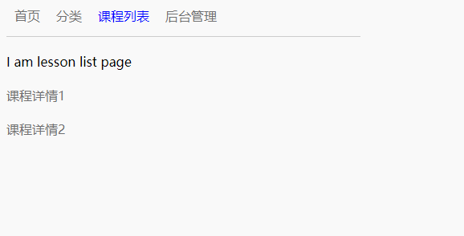

requirejs-avalon1.4.7-SPA-seed
===

### Demo Clone
- $ `git clone git@github.com:johnnynode/requirejs-avalon1.4.7-SPA-seed.git --depth 1`

### Demo install
- $ `npm i` 或 $ `yarn install` 

### Demo run
- $ `gulp server`

###  pictures

    
  

### Reference [docs and examples]  
- http://ued.qunar.com/oniui/mmRouter/avalon.mmRouter.doc.html
- https://github.com/gogoyqj/mmRouter-demo-list
- https://github.com/gogoyqj/mmRouter-demo-list/blob/master/requirejs/www/script/lib/oniui/mmRouter/mmState.js
- https://github.com/gogoyqj/mmRouter-demo-list/blob/master/requirejs/www/script/lib/oniui/mmRouter/mmRouter.js
